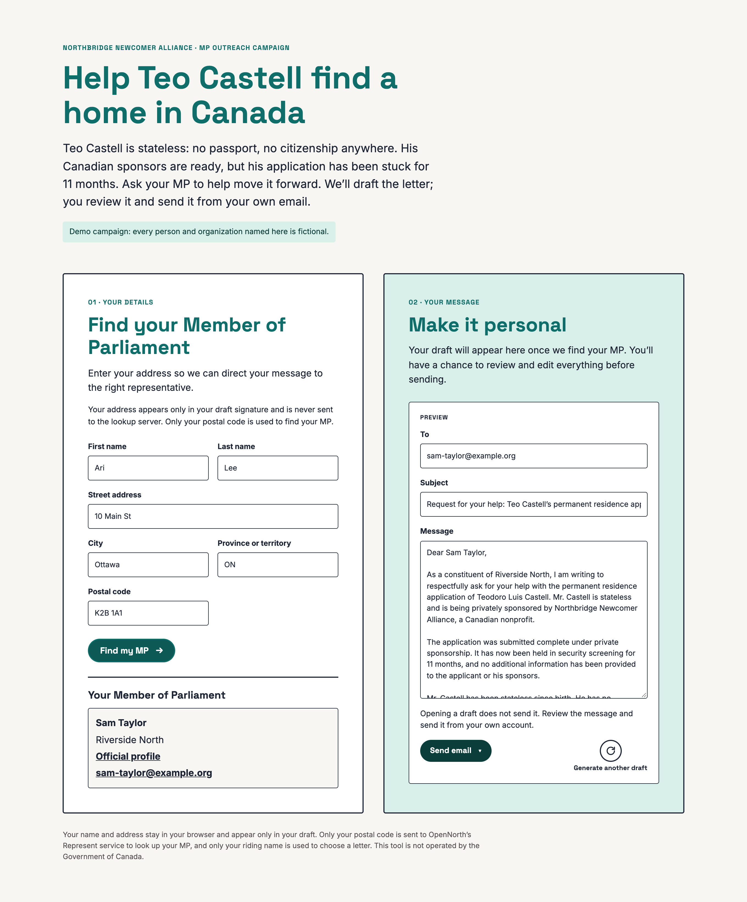
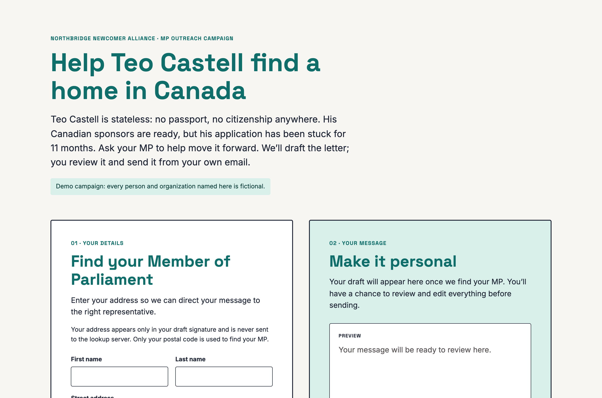
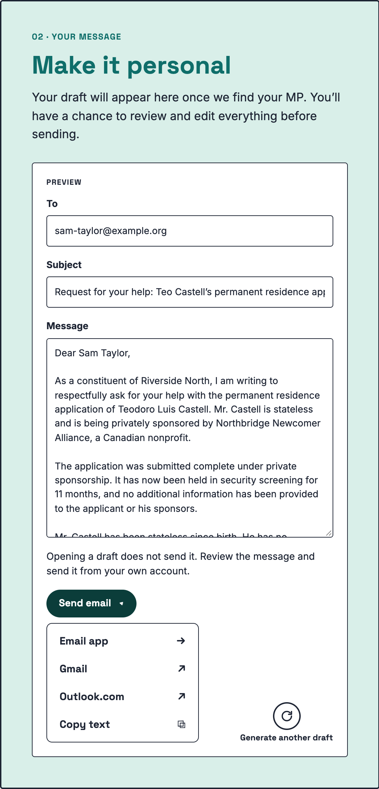
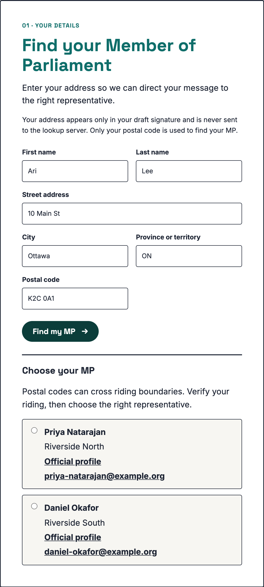
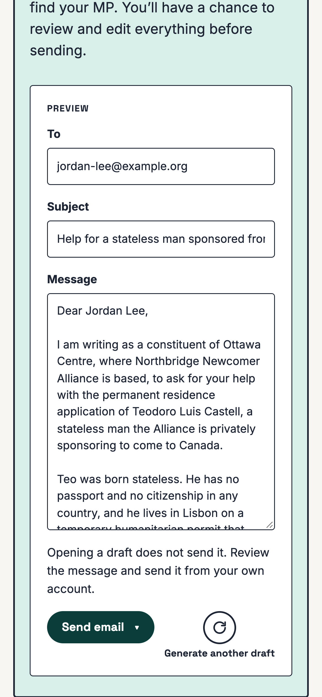
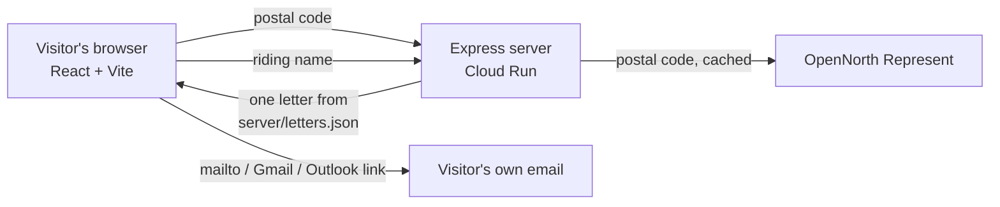

# Write Your MP

A small full-stack app for advocacy campaigns. A visitor enters their postal code and gets a pre-written letter to their Member of Parliament, with their MP, riding, name and address already filled in. They edit it, then send it from their own email account.

I built this for a Canadian nonprofit advocating for a stateless person trying to make their way to Canada. The advocacy ran as a coordinated outreach campaign to Members of Parliament, with this tool embedded in the nonprofit's WordPress site and hosted on Google Cloud Run. This copy replaces the real case and branding with a **fictional demo campaign**; every person and organization in it is made up.



## What it does

- **Finds the right MP from a postal code** using [OpenNorth's Represent API](https://represent.opennorth.ca/), including postal codes that straddle two ridings, where the visitor picks their MP.
- **Fills in a letter** from a library of reviewed variants, so MPs receive differently worded letters rather than one copied text. Ridings can have their own letters (here, the riding where the sponsoring nonprofit is based).
- **Lets the visitor edit everything**, then open the letter in their email app, Gmail or Outlook.com, or copy it. "Generate another draft" swaps in a different letter.
- **Keeps personal details in the browser.** Only the postal code reaches the server (to look up the MP), and only the riding name is used to pick a letter.
- **Embeds in any site** as an iframe that resizes itself to its content; `FRAME_ANCESTORS` sets which sites may embed it.
- **Works on phones** and with keyboards and screen readers.

| Start | Send menu | Postal code in two ridings | Phone |
|---|---|---|---|
|  |  |  |  |

## Run it locally

You need Node 24. The demo mode answers MP lookups with fictional MPs, so it runs offline and never calls OpenNorth.

```bash
npm install
npm run demo
```

Open http://localhost:8080/campaign/ and try these postal codes:

| Postal code | Result |
|---|---|
| `K2B 1A1` (most codes) | One MP, general letters |
| `K1P 1A1` | The campaign's home riding, which has its own letters |
| `K2C 0A1` | A postal code split between two ridings: pick your MP |

To look up real MPs through OpenNorth instead, run `npm run build && npm start`.

For development with hot reload, run the API and the page in two terminals:

```bash
npm run dev:api   # Express on :8080, demo MPs, restarts on change
npm run dev       # Vite on :5173, forwards /campaign/api to :8080
```

Or run the production container:

```bash
docker build -t write-your-mp .
docker run --rm -p 8080:8080 write-your-mp
```

## How it works



- **Server** (`server/`): Express 5. `POST /campaign/api/lookup-mp` validates the postal code, then answers from an in-memory cache or asks Represent. `GET /campaign/api/letter` picks a letter for the riding, skipping the one already shown. Lookups are cached for the life of the instance, since Represent allows a server 60 requests a minute.
- **Browser** (`src/`): React 19 and TypeScript. The visitor's name and address are merged into the letter locally, and the send links are built in the browser, so no personal details touch the server.
- **Letters** (`server/letters.json`): stay on the server so the page source never lists the whole library. Every letter must pass `scripts/validate-letters.mjs`, which checks required facts, bans claims the original letter doesn't make, and checks placeholders and the signature block. `npm run build` fails if any letter fails.

## Generating letter variants with an LLM

`scripts/generate_letters.py` writes new variants with any OpenAI-compatible endpoint (I used Qwen on a self-hosted vLLM server) and only keeps those that pass every check:

- **Shorthand facts, not prose.** The model gets the campaign's facts as clipped notes (`scripts/lettergen/content.py`); given polished sentences, it copied them into every letter.
- **A fixed outline with varied details.** Each letter opens with the whole ask, but gets its own opening style, order of details, and wording of the stance.
- **Two-pass sampling.** Optionally, the model reasons at a higher temperature in one request, then writes the letter at a lower one in a second request that continues from that reasoning (vLLM applies one temperature per request).
- **A checker pass.** A second request compares each draft with the original letter and rejects unsupported claims, missing facts, a weak opening, or a missing call to action.
- **Repetition control.** Drafts that share more than 30% of their six-word phrases with a kept letter are rejected, and wordings already common across letters are fed back so later letters avoid them.

```bash
OPENAI_BASE_URL=http://localhost:8000/v1 OPENAI_MODEL=your-model \
  uv run scripts/generate_letters.py --general 300 --home 40 -c 8
```

`scripts/trial-letters.sh` produces a review report instead (tones, prompts, settings, checker results and output for each letter), updated as letters finish.

## Security

- A strict Content-Security-Policy: only the app's own scripts plus a hash of its inline config; no `unsafe-inline`.
- Per-visitor rate limits (20 lookups and 120 letters a minute), so one client can't use up the shared OpenNorth allowance.
- `nosniff`, a referrer policy, no `X-Powered-By`, JSON errors instead of framework error pages, and only `https` profile links passed through from Represent.
- On Cloud Run, the service runs as an account with no IAM roles, and GitHub Actions deploys through Workload Identity Federation with SHA-pinned actions and no stored keys.

## Tests

```bash
npm test                # 69 server and script tests (node --test) + 36 browser tests (Vitest, Testing Library)
npm run test:generator  # 64 Python tests for the generator (needs uv)
npm run screenshots     # regenerates docs/screenshots with Playwright and your installed Chrome
```

CI (`.github/workflows/ci.yml`) runs type checks, all three suites and the build on every push.

## Deploying

`Dockerfile`, `deploy/cloudrun-service.yaml` and a manual GitHub Actions workflow are included; this copy is not deployed anywhere. [docs/deploy.md](docs/deploy.md) has the one-time Google Cloud setup and the WordPress embed snippet.

## Using it for another campaign

1. Replace the letters in `server/letters.json`, and the facts in `scripts/validate-letters.mjs` that every letter must keep.
2. Update the page text in `src/App.tsx` and the colours and fonts at the top of `src/styles.css`.
3. To generate variants, rewrite the notes in `scripts/lettergen/content.py`.

## Project layout

```
server/            Express app, Represent client, lookup cache, letter picker, demo MPs
src/               React app: lookup form, MP picker, letter editor, send menu, iframe resizing
scripts/           Letter validator, LLM generator and trial runner (Python), screenshot script
tests/             node --test, Vitest and Python unittest suites
deploy/, Dockerfile, .github/workflows/   Container, Cloud Run service and CI/CD
```

## License

MIT. See [LICENSE](LICENSE).
